# Trabajo Práctico Obligatorio 3

## DESCRIPCION

Somos dos desarrolladores web apasionados por la tecnología y en constante formación. Actualmente nos encontramos cursando la carrera de Desarrollo de Software, lo que nos permite combinar la práctica profesional con una base académica sólida.

El enfoque de este proyecto es darnos a conocer con nuestros compañeros y crecer como profesionales mientras participamos durante el proyecto, fomentando la colaboración, la innovación y la mejora continua.

Incluye una SPA (Single Page Application) con paginación y componentes que permiten el acceso a una portada con información sobre el proyecto, a las tarjetas de los integrantes, secciones donde se consume un archivo JSON y una API, y a la bitácora.

## TECNOLOGIAS UTILIZADAS

- JSX
- CSS
- JavaScript
- React.js
- React Router
- Animate.css
- Vite
- Vercel

## ESTRUCTURA DE ARCHIVOS

Los archivos en la raíz como package.json, vite.config.js, index.html y eslint.config.js son esenciales para la configuración del proyecto, dependencias, build y linteo de código, mientras que la carpeta public contiene como activo estático un archivo de datos (directors-data.json) accesible directamente.

La lógica principal reside en el directorio src, con main.jsx como punto de entrada que renderiza la aplicación definida en App.jsx. Dentro de src, la carpeta assets almacena recursos multimedia, y components es el corazón de la aplicación, agrupando la interfaz en módulos reutilizables (como avalos, paguaga, seccion-api, homepage, etc.), cada uno con sus propios archivos de lógica (.jsx) y estilos modulares (.module.css), facilitando un desarrollo escalable, mantenible y basado en componentes.

```bash
.
│   .gitignore
│   eslint.config.js
│   index.html
│   package.json
│   README.md
│   vercel.json
│   vite.config.js
│
├───public
│       directors-data.json
│
└───src
    │   App.jsx
    │   App.module.css
    │   index.css
    │   main.jsx
    │
    ├───assets
    │       avalos.png
    │       el_origen.jpg
    │       halftone_bg.avif
    │       joker.jpg
    │       matrix.jpg
    │       paguaga.png
    │       reactivos.jpeg
    │       structure_diagram.png
    │       tree_diagram.png
    │
    ├───components
    │   ├───boton-navegacion
    │   │       BotonNavegacion.module.css
    │   │       index.jsx
    │   │
    │   ├───button
    │   │       Button.module.css
    │   │       index.jsx
    │   │
    │   ├───buttons-section
    │   │       ButtonsSection.module.css
    │   │       index.jsx
    │   │
    │   ├───director-card
    │   │       DirectorCard.module.css
    │   │       index.jsx
    │   │
    │   ├───footer
    │   │       Footer.module.css
    │   │       index.jsx
    │   │
    │   ├───habilidad
    │   │       Habilidad.module.css
    │   │       index.jsx
    │   │
    │   ├───image-gallery
    │   │       ImageGallery.module.css
    │   │       index.jsx
    │   │
    │   ├───lightbox
    │   │       index.jsx
    │   │       Lightbox.module.css
    │   │
    │   ├───modal-trailer
    │   │       index.jsx
    │   │       ModalTrailer.module.css
    │   │
    │   ├───movie-card
    │   │       index.jsx
    │   │       MovieCard.module.css
    │   │
    │   ├───scroll-to-top
    │   │       index.jsx
    │   │
    │   ├───sidebar
    │   │       index.jsx
    │   │       Sidebar.module.css
    │   │       SidebarItem.jsx
    │   │       SidebarItem.module.css
    │   │
    │   ├───slider
    │   │       index.jsx
    │   │       Slide.jsx
    │   │       Slider.module.css
    │   │
    │   ├───spotify
    │   │       index.jsx
    │   │       Spotify.module.css
    │   │
    │   └───title
    │           index.jsx
    │           Title.module.css
    │
    └───pages
        ├───avalos
        │       Avalos.module.css
        │       ComicPage.jsx
        │       ComicPage.module.css
        │       index.jsx
        │
        ├───bitacora
        │       Bitacora.module.css
        │       BitacoraItems.jsx
        │       index.jsx
        │
        ├───diagramas
        │       DiagramItems.jsx
        │       Diagrams.module.css
        │       index.jsx
        │
        ├───directores
        │       index.jsx
        │       MovieDirectorList.module.css
        │
        ├───estrenos
        │       index.jsx
        │
        ├───homepage
        │       Homepage.module.css
        │       index.jsx
        │
        ├───not-found
        │       index.jsx
        │       NotFound.module.css
        │
        ├───paguaga
        │       index.jsx
        │       index.module.css
        │       Tarjeta.jsx
        │       Tarjeta.module.css
        │
        └───peliculas
                index.jsx
                MovieCardList.jsx
                MovieCardList.module.css
                MovieModal.jsx
                MovieModal.module.css
                MovieSection.module.css
```

# LISTADO DE MEJORAS

## Mejora 1: Mejora de la Interfaz: Animaciones Suaves

### Descripción:

Se incorporaron animaciones visuales con Animate.css para mejorar la experiencia del usuario y hacer las transiciones entre secciones más fluidas y atractivas.
Estas animaciones se aplican a títulos y elementos destacados del sitio, generando una sensación de dinamismo y modernidad en la interfaz.

### Animación 1:

Deslizamiento lateral del menú (Sidebar) con efecto slideInLeft

### Antes

El menú lateral (sidebar) aparecía de forma instantánea, sin ninguna animación.
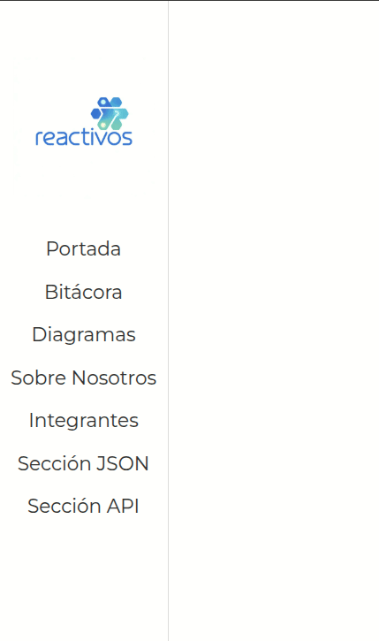

### Después

Ahora, cuando se despliega el sidebar, los elementos del menú aparecen con un efecto slideInLeft.
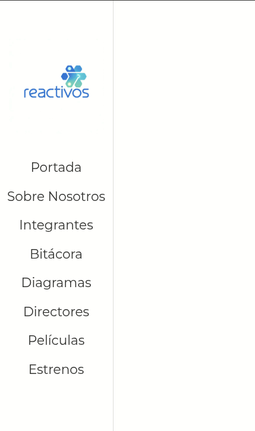

### Animación 2:

Aparición de los elementos de la bitácora con efecto zoomInDown

### Antes

Los elementos de la bitácora aparecían todos al instante, sin ningún tipo de animación.
La transición entre las distintas entradas era brusca y no ofrecía una sensación visual fluida.
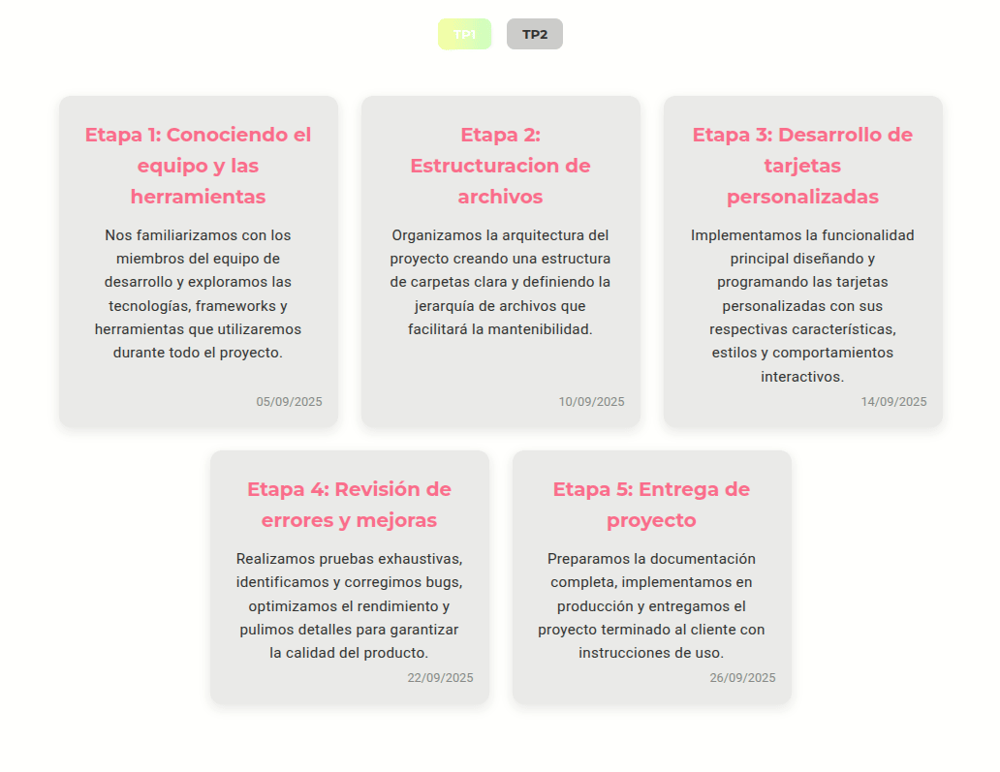

### Después

Los elementos ahora aparecen con una animación tipo zoomInDown, generando un efecto visual más dinámico y agradable.
Al cambiar de entradas, las tarjetas se animan nuevamente, reforzando la sensación de interacción fluida.
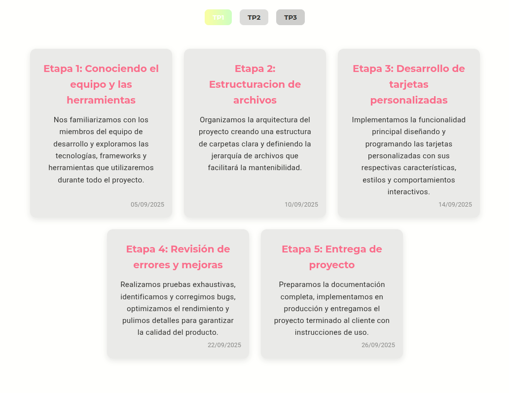

### Animación 3:

Aparición del título con efecto fadeInDown

### Antes

El título aparecía de forma estática, sin ningún tipo de animación o transición visual.
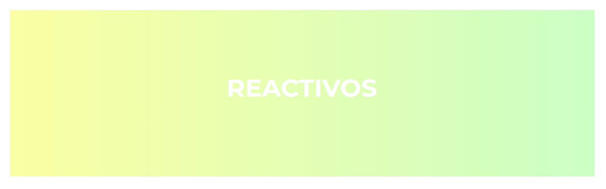

### Después

El título ahora se muestra con un efecto de entrada suave desde arriba (fadeInDown) al cargar la sección.
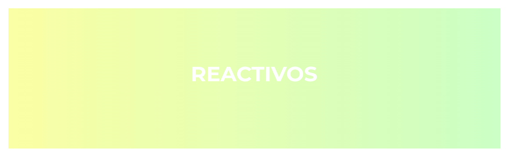

### Animación 4:

Aparición progresiva de los diagramas con efecto fadeIn

### Antes

Los diagramas aparecían de forma instantánea al cambiar entre uno y otro, sin ningún tipo de transición o animación.
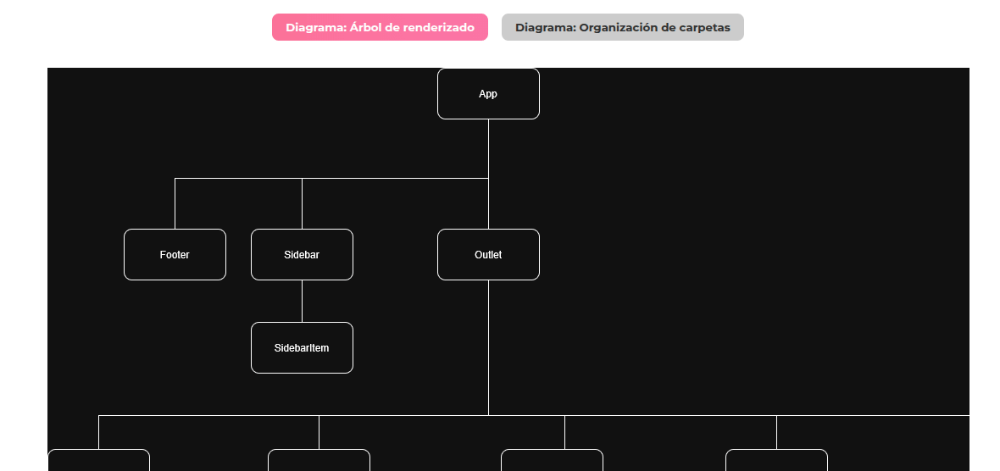

### Después

Al cambiar de diagrama o cargar la sección, la imagen se muestra con una animación suave de aparición (fadeIn), lo que mejora la experiencia visual del usuario.
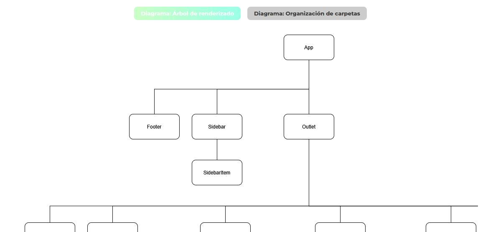

### Animación 5:

Aparición lateral de las tarjetas de directores con efecto bounceInRight

### Antes

Las tarjetas de directores aparecían de manera estática y simultánea, sin ningún tipo de animación o transición visual al cargar o filtrar resultados.
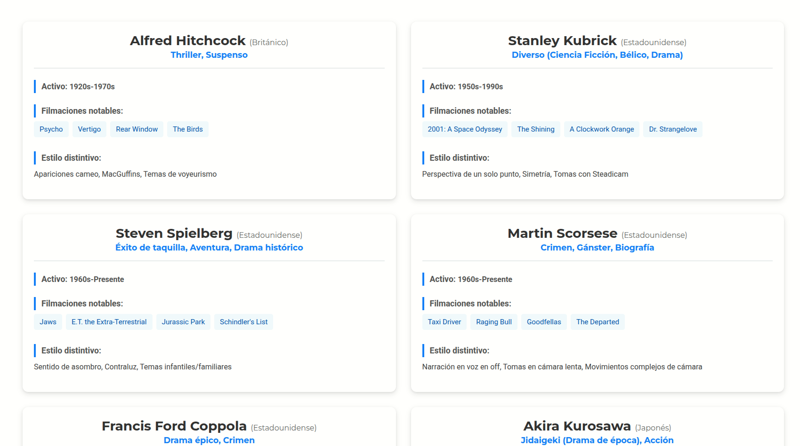

### Después

Ahora, al cargar la sección o aplicar un filtro, las tarjetas aparecen con una animación de entrada lateral (bounceInRight), aportando dinamismo y una sensación más fluida a la experiencia visual.
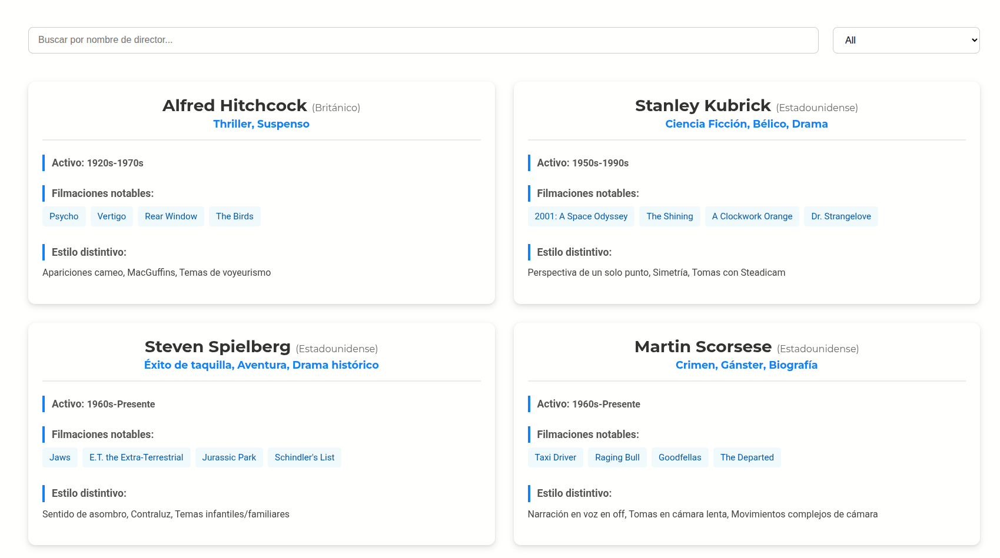

### Animación 6:

Aparición de las tarjetas de películas con efecto bounceInUp

### Antes

Las películas se mostraban instantáneamente al cargar la página o cambiar de filtro, sin ningún tipo de transición ni animación visual.
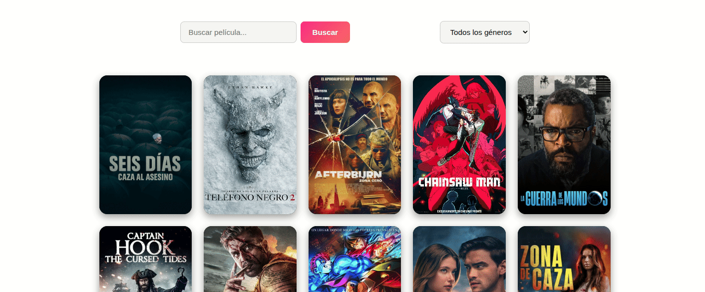

### Después

Ahora, las tarjetas de películas aparecen suavemente desde abajo mediante el efecto bounceInUp, logrando una transición más fluida al cargar los resultados o al cambiar entre búsquedas y géneros.


### Animación 7:

Aparición de los pósters de estrenos con efecto bounceInUp

### Nueva implementación

En esta entrega se incorporó la nueva sección Estrenos, ausente en el trabajo anterior.
Se muestran con una animación bounceInUp, la misma utilizada en la sección de Películas, este efecto genera una entrada suave desde la parte inferior, transmitiendo dinamismo y manteniendo coherencia visual con el resto del sitio.


## Mejora 2: Búsqueda/Filtrado en JSON Local

### Descripción:

Implementación de búsqueda por texto y filtrado por categoría en JSON local

### Antes

La sección de Directores mostraba todos los registros del archivo directors-data.json sin permitir ningún tipo de filtrado o búsqueda.
Esto hacía que el usuario tuviera que desplazarse manualmente por toda la lista para encontrar un director específico.
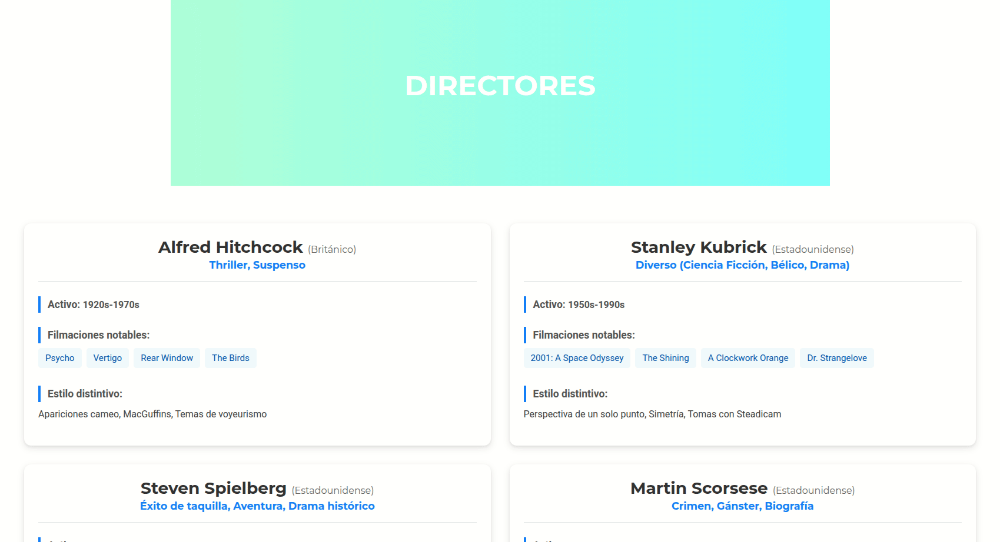

### Después

Ahora, se implementó un buscador por texto y un filtro por categorías (géneros) que permite al usuario localizar rápidamente a un director en función de su nombre o del tipo de películas por las que es conocido.
Esta mejora hace la navegación mucho más dinámica e intuitiva.


## Mejora 3: Paginación para la API Externa

### Descripción:

Se implementó paginación con botones dinámicos para mejorar el rendimiento y la navegación.

### Antes

Al final del TP2 la lista de películas se limitaba a los resultados de la página 1 de la API, lo que impedía al usuario consultar más contenido y hacía la navegación limitada.


### Después

Se añadió paginación con botones dinámicos (Anterior / Siguiente).  
Esto mejora la experiencia y el rendimiento porque la interfaz carga solo la página necesaria en cada interacción.


## Mejora 4: Galería de Imágenes Interactiva

### Descripción:

En esta entrega se incorporó una galería de imágenes interactiva para la sección de Estrenos.  
Al hacer clic sobre cualquiera de los pósters, se abre un lightbox con navegación entre imágenes, soporte para zoom y la posibilidad de cerrar tanto con un botón como presionando la tecla ESC.  
Esta mejora brinda una experiencia más inmersiva e intuitiva, permitiendo explorar los estrenos de forma visual y moderna.


## Mejora 5: Barras de Progreso de Habilidades

### Descripción:

Se añadieron barras de progreso animadas que representan visualmente el nivel de cada habilidad dentro de los perfiles de los integrantes.

### Antes

En la entrega anterior, los perfiles mostraban únicamente una lista estática de habilidades sin ningún tipo de indicador visual o animación.
Esto hacía difícil percibir el nivel de dominio de cada habilidad.

**Tarjeta Ávalos:**  
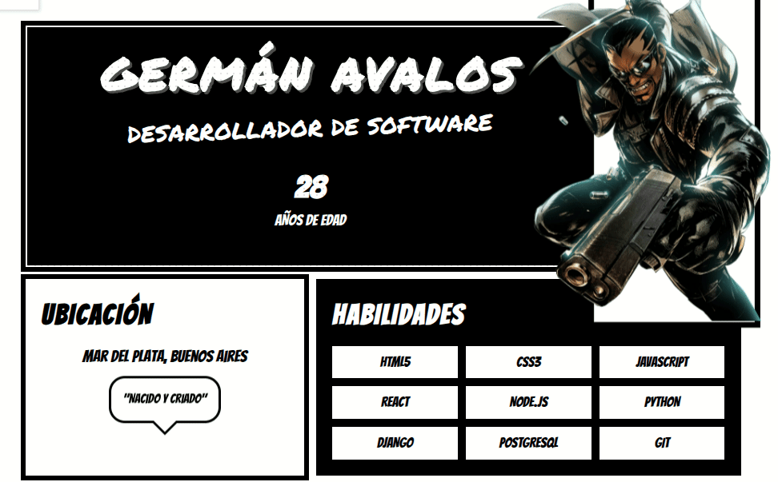

**Tarjeta Paguaga:**  
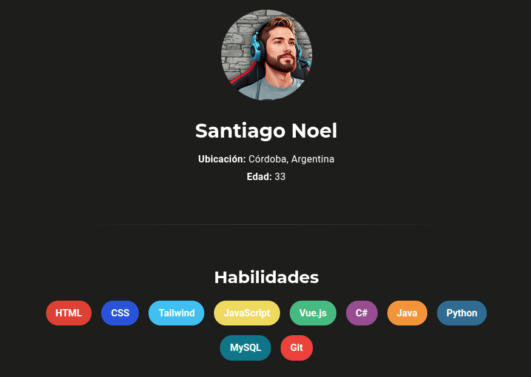

### Después

Ahora, las habilidades se representan con barras de progreso animadas, transmitiendo de forma clara y visual el nivel de competencia de cada integrante.

**Tarjeta Ávalos:**  
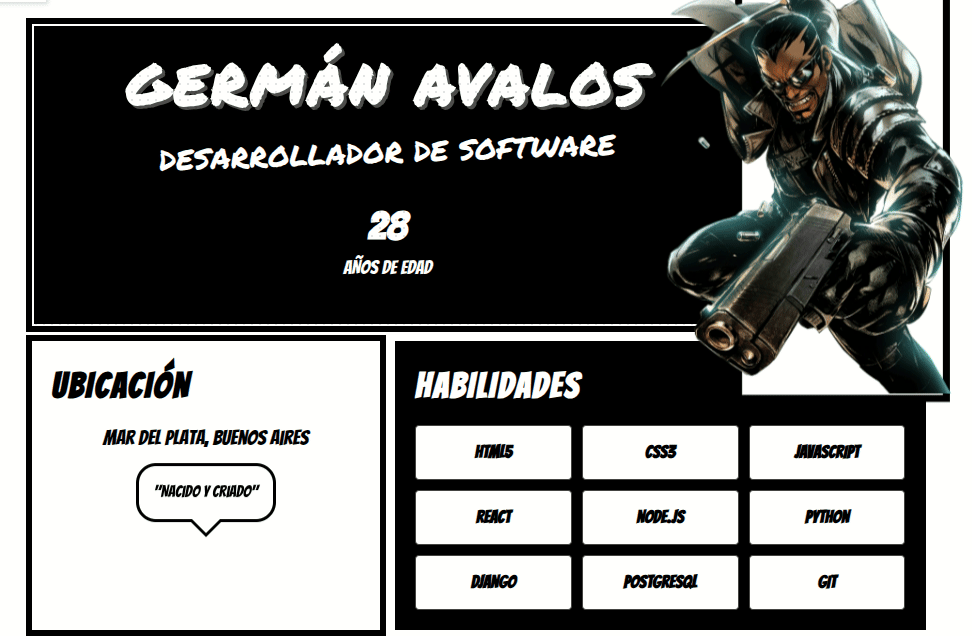

**Tarjeta Paguaga:**  
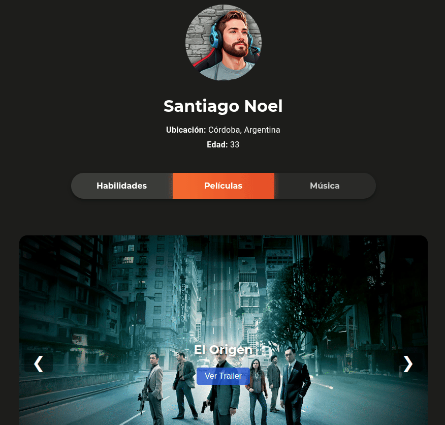

## INTEGRANTES

- Avalos, Santiago Germán
- Paguaga, Santiago Noel

## LINKS

Deploy: [dswf-tp2-grupo16.vercel.app](https://dswf-tp2-grupo16.vercel.app)

GitHub: [dswf-tp2-grupo16](https://github.com/sanavalos/dswf-tp2-grupo16)
